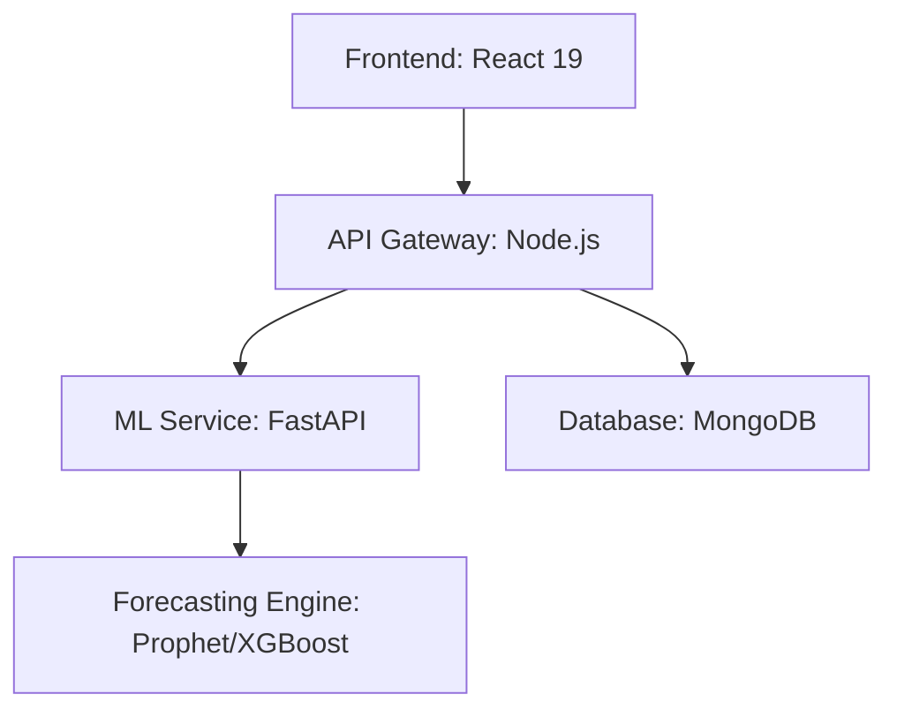

# 🏙️ CitySentinel AI: Urban Crisis Intelligence
### *Predictive Urban Environmental Crisis Simulator (PUECS)*

<div align="center">

```text
    ____  ____  ____  ______     __ __ ____ _       __    ______ ____  _____
   / __ \/ __ \/ __ \/_  __/    / //_//  _// /      / /   / ____// __ \/__  /
  / /_/ / / / / / / / / /      / ,<   / / / /      / /   / __/  / /_/ /  / / 
 / _, _/ /_/ / /_/ / / /      / /| |_/ / / /___   / /___/ /___ / _, _/  / /__
/_/ |_|\____/\____/ /_/      /_/ |_/___//_____/  /_____/_____//_/ |_| /____/
```

**Designed and Developed by Team Root Killerz**

---

### 🏆 Achievement
**Won 3rd Prize in BITM College, Ballari (Ballari Hackathon - Challenge 6)**

---

---

### 🏆 Achievement
**Won 3rd Prize in BITM College, Ballari (Ballari Hackathon - Challenge 6)**

---

</div>

## 📖 Overview

**CitySentinel AI** is a state-of-the-art urban crisis management platform designed for the modern smart city. It uses predictive modeling and cascading risk analysis to forecast environmental emergencies — from AQI spikes to water stress — and provides actionable policy recommendations for city administrators.

## 🌟 Key Features

-   🚀 **Cascading Risk Analysis**: Models dependencies between urban systems (Infrastructure → Ecology → Health) to predict how a localized failure amplifies into a city-wide crisis.
-   🎲 **Monte Carlo Policy Simulations**: Stress-test urban resilience by simulating up to 5 concurrent policy scenarios side-by-side.
-   ⚖️ **Decision Support System**: Ranked policy interventions based on "Efficiency Score" (Risk Reduction vs. Implementation Cost).
-   🗺️ **Zonal Risk Heatmap**: High-fidelity temporal visualization of risk propagation across 5 urban zones.
-   🤖 **ML-Powered Forecaster**: Advanced forecasting using **Prophet** and **XGBoost** for confidence-weighted crisis probabilities.

## 🏗️ Architecture



| Component | Technology | Responsibility |
| :--- | :--- | :--- |
| **Frontend** | React, TypeScript, Tailwind 4 | Interactive Dashboards & Simulations |
| **Backend** | Node.js, Express, MongoDB | Risk Engines & API Orchestration |
| **ML Service** | Python, Prophet, XGBoost | Time-series Forecasting & Risk Quantification |

## 🚀 Quick Start

### 1. Requirements
- Node.js (v18+)
- Python (3.9+)
- MongoDB

### 2. Installation

```bash
# Clone the repository
git clone https://github.com/nikhilmanvi360/urban-crisis-simulator.git
cd urban-crisis-simulator

# Setup Backend
cd backend && npm install && npm start

# Setup ML Service
cd ../smart_city_ml && pip install -r requirements.txt && python main.py

# Setup Frontend
cd ../frontend && npm install && npm run dev
```

---

## 🎖️ BITM Ballari Hackathon
This project was developed for the **Ballary Hackathon** at **BITM College**, focusing on **Challenge 6: Urban Resilience**. It secured the **3rd Prize** for its innovative approach to cascading risk modeling and intuitive decision-support interface.

---

<div align="center">
Built with ❤️ by the CitySentinel Team
</div>
